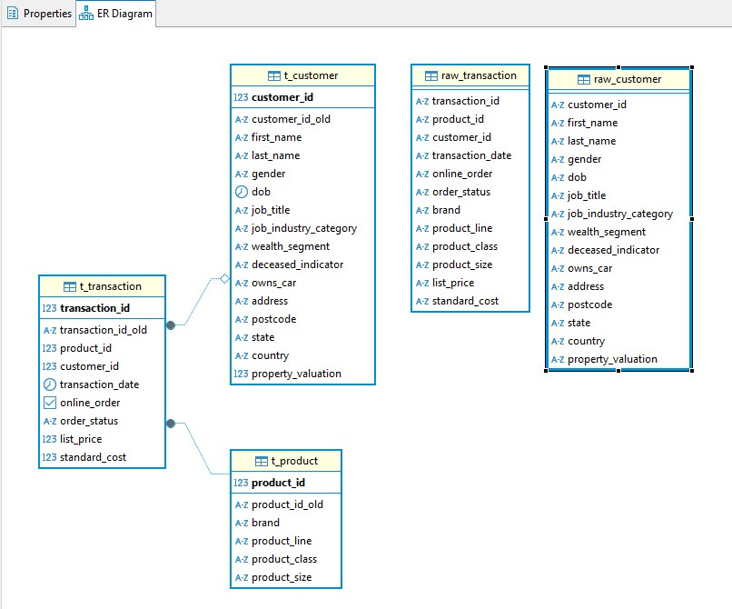

# 📊 Задание 1: Системы хранения и обработки данных. Домашнее задание 1 (vo_HW)

## 📂 Результат

✅ 
**(2 балла) Продумать структуру базы данных и отрисовать в редакторе.**  
 Структура базы данных отрисована в редакторе: [dbdiagram.io](https://dbdiagram.io/d/HW1-67b23c2f263d6cf9a056e593) 

  
Dbeaver ER diagram

  
  
  

✅
**(2 балла) Нормализовать базу данных (1НФ — 3НФ), описав, к какой нормальной форме приводится таблица и почему таблица в этой нормальной форме изначально не находилась.**  
Таблицы приведены к 3НФ:
- **1НФ:** Каждая таблица содержит атомарные значения. 
- **2НФ:** Устранены частичные зависимости. Исходная таблица содержала повторяющуюся информацию о клиентах и продуктах в каждой транзакции. Для решения этой проблемы данные разделены на отдельные таблицы `t_customer` и `t_product`, в которых все неключевые атрибуты зависят полностью от первичного ключа.
- **3НФ:** Устранены транзитивные зависимости. Информация о продукте (бренд, линия, класс, размер) перенесена в отдельную таблицу `t_product`, а транзакционная информация – в `t_transaction`, где ссылаются на клиента и продукт через внешние ключи. Таким образом, атрибуты зависят непосредственно от первичного ключа своей таблицы, а не от других неключевых атрибутов.

> **Комментарий по нормализации:**  
> Исходные данные не удовлетворяли нормальным формам из-за:
> - **Дублирования информации:** Одни и те же данные по клиенту и продукту повторялись в каждой записи транзакции.
> - **Нарушения атомарности:** Данные хранились в виде строк, а не специализированных типов (например, `date`, `int`).
> - **Частичных и транзитивных зависимостей:** Некоторые атрибуты зависели не от идентификатора записи, а от других полей, что могло привести к аномалиям при обновлении данных.
>
> Приведение к 1НФ, 2НФ и 3НФ решило эти проблемы, позволив:
> - Хранить каждое значение в отдельном поле (атомарность).
> - Избавиться от дублирования данных (разделение таблиц).
> - Гарантировать, что все неключевые поля зависят напрямую от первичного ключа.

✅
**(3 балла) Создать все таблицы в DBeaver, указав первичные ключи к таблицам, правильные типы данных, могут ли поля быть пустыми или нет (использовать команду CREATE TABLE).**  
Таблицы созданы с помощью SQL-команд с указанием первичных ключей, типов и ограничений. Код представлен в файле `database_procedures.sql`.

✅
**(3 балла): Загрузить данные в таблицы в соответствии с созданной структурой (использовать команду INSERT INTO или загрузить файлы, используя возможности инструмента DBeaver; в случае загрузки файлами приложить скрины, что данные действительно были залиты).**   
Данные загружены из CSV-файлов через DBeaver. 

  
Данные

  
  
  

## 📥 Импорт данных
- 📊 **Исходные данные:** Excel-файл `customer_and_transaction.xlsx`.
- 📝 **Конвертация в CSV:** Данные из листов `customer` и `transaction` были экспортированы в файлы `raw_customer.csv` и `raw_transaction.csv` с помощью Excel.
- 💾 **Импорт в PostgreSQL:** CSV-файлы были загружены в таблицы `raw_customer` и `raw_transaction` через DBeaver.

## 🐍 Автоматизация импорта через Python
- Для автоматизации импорта был написан Python-скрипт (`load_data.py`), который загружает данные из Excel напрямую в PostgreSQL с помощью библиотеки `pandas` и `sqlalchemy`.
- Скрипт позволяет при необходимости повторно загрузить данные без ручного импорта.

## 🛠️ Нормализация базы данных
- **Процесс нормализации:**
  - **1НФ (Первая нормальная форма):**  
    Все данные разбиты на отдельные, неделимые элементы. Например, дата рождения или дата транзакции преобразованы из строк в тип `date`, что обеспечивает атомарность значений.
  - **2НФ (Вторая нормальная форма):**  
    Исключены частичные зависимости. Информация о клиентах и продуктах, которая повторялась в исходной таблице транзакций, теперь хранится в отдельных таблицах. Таким образом, все неключевые атрибуты зависят полностью от первичного ключа своей таблицы.
  - **3НФ (Третья нормальная форма):**  
    Устранены транзитивные зависимости. Информация о продукте, ранее включавшаяся в транзакционные данные, вынесена в отдельную таблицу `t_product`, что позволяет избежать зависимости одного неключевого атрибута от другого.

- **Использование ограничения NOT NULL:**  
  Для первичных ключей ограничение `NOT NULL` применяется автоматически. Для остальных полей применение `NOT NULL` не всегда использовались из-за отсутствия комментария по данным:
  - Если поле обязательно для заполнения (например, имя клиента или дата транзакции), можно задать ограничение `NOT NULL` для повышения целостности данных.
  - В данном решении ключевые зависимости обеспечиваются через уникальные идентификаторы и составные ключи, поэтому для остальных полей ограничение `NOT NULL` не всегда критично. Логика обработки данных и валидация на уровне приложения помогают обеспечить корректность импортируемых данных.

- Выполнены преобразования для приведения типов, включая обработку дат (`TO_DATE`), пустых значений (`NULLIF`), и числовых форматов (`FLOAT8`).
- В таблицу `t_customer` вручную добавлена запись для клиента с ID `5034`, так как он присутствовал в транзакциях, но отсутствовал в исходных данных о клиентах.

## 📝 Файлы проекта
- `database_procedures.sql` — полный SQL-скрипт со всеми процедурами создания, импорта и проверки данных.
- `load_data.py` — Python-скрипт для автоматического импорта данных в базу.
- `data_verify.png` — скриншот, подтверждающий успешную загрузку всех данных в базу.
- `ER_diagram.jpg` — зависимость таблиц.

## ✅ Проверка качества данных
- Проведена проверка согласованности данных между сырыми (`raw_`) и нормализованными (`t_`) таблицами с помощью запросов с `EXCEPT`.
- Итоговая проверка показала **отсутствие расхождений** между исходными данными и нормализованной базой.
- Количество уникальных записей в таблицах совпало:
  - Клиенты: `raw_customer` ↔ `t_customer` + 1 (5034 случай)
  - Транзакции: `raw_transaction` ↔ `t_transaction`
