# 📊 Задание 2: Основные операторы PostgreSQL (vo_HW)

## 📝 Файлы

Все запросы доступны в файле HW2.sql

## 📂 Задачи

✅ 
**Создать таблицы со следующими структурами и загрузить данные из csv-файлов.**

  
Пруф

  
  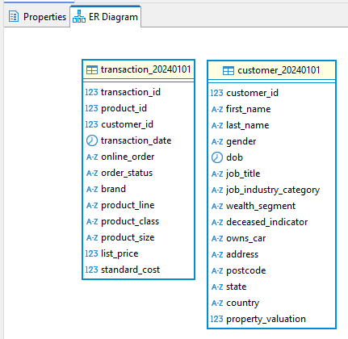
  
  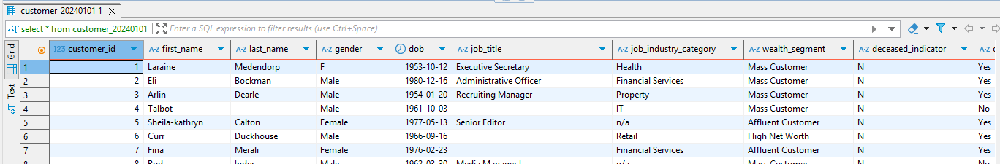

  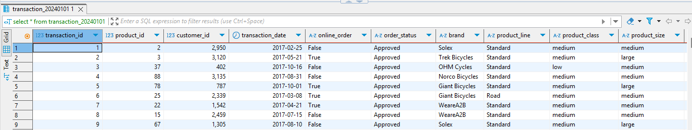
  

 

✅ 
**(1 балл) Вывести все уникальные бренды, у которых стандартная стоимость выше 1500 долларов.**

  
Пруф

  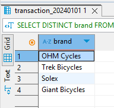

 

✅ 
**(1 балл) Вывести все подтвержденные транзакции за период '2017-04-01' по '2017-04-09' включительно.**

  
Пруф

  
  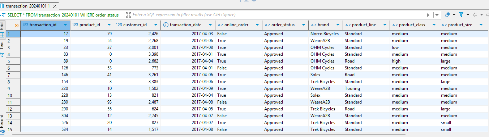

 

✅ 
**(1 балл) Вывести все профессии у клиентов из сферы IT или Financial Services, которые начинаются с фразы 'Senior'.**

  
Пруф

  
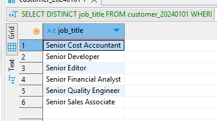

 

✅ 
**(1 балл) Вывести все бренды, которые закупают клиенты, работающие в сфере Financial Services**

  
Пруф

  
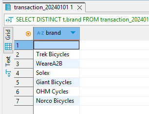

 

✅ 
**(1 балл) Вывести 10 клиентов, которые оформили онлайн-заказ продукции из брендов 'Giant Bicycles', 'Norco Bicycles', 'Trek Bicycles'.**

  
Пруф

  
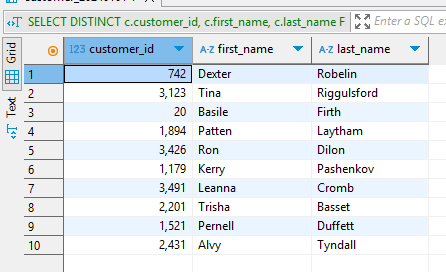

 

✅ 
**(1 балл) Вывести всех клиентов, у которых нет транзакций.**

  
Пруф

  
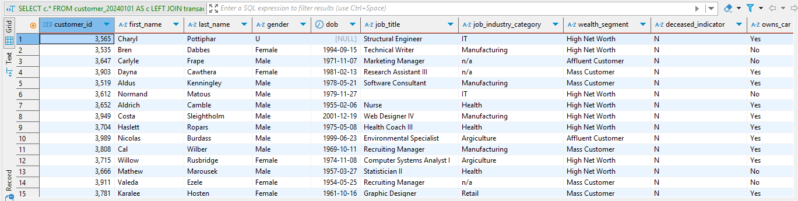

 

✅ 
**(2 балла) Вывести всех клиентов из IT, у которых транзакции с максимальной стандартной стоимостью.**

  
Пруф

  
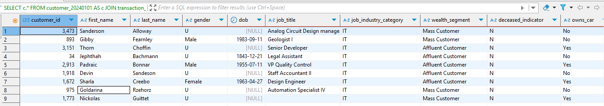

 

✅ 
**(2 балла) Вывести всех клиентов из сферы IT и Health, у которых есть подтвержденные транзакции за период '2017-07-07' по '2017-07-17'.**

  
Пруф

  
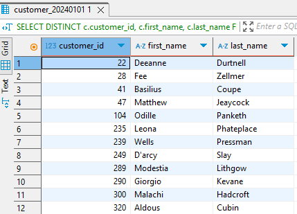

 
